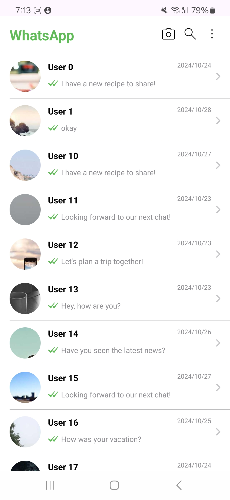
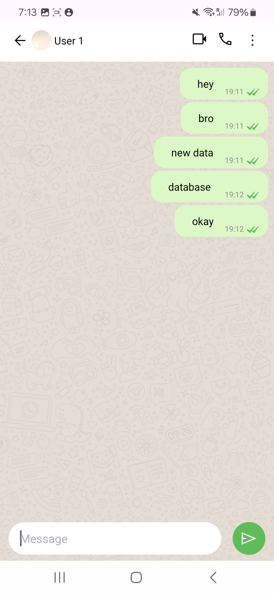

## Download 📥
- Download latest APK from [Click Here](https://drive.google.com/file/d/1m_7SUK7SBSU_NatzNcsZrrIRKea6W4G3/view)

## Built With 🛠

- **Android SDK** 📱 - Ensuring compatibility across multiple Android devices.
- **Kotlin** 🦸 - Taking advantage of Kotlin's expressiveness and conciseness.
- **Clean Architecture** 🏗️  - Ensuring modularity and easy maintenance.
- **Hilt Dependency Injection** 🔌  - For streamlined dependency management.
- **Coroutines** ⏳  - For seamless, non-blocking background tasks.
- **Paging 3 📄 **  - To handle paginated data with optimized performance

### Additional Tech

- **Android Jetpack Components** 📦 
- **Flow** 🌊
- **Navigation Component** 🧭
- **Data Binding** 🔗
- **SOLID**
- **Android SDK**
- **Glide** 📱

And more! ✨

## Architecture 🗼

This project follows the famous Clean architecture and best practices from Google's
[GithubBrowserSample](https://github.com/android/architecture-components-samples/tree/master/GithubBrowserSample)

## Permissions 💻
- Internet

